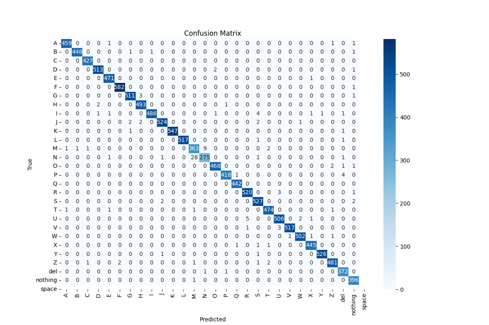
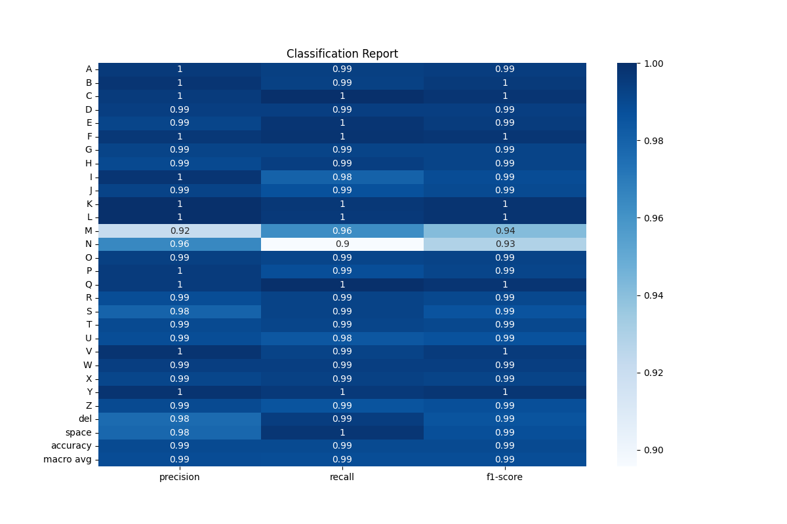

# Signez - Interactive ASL Alphabet Learning powered by Real-Time Hand Sign Recognition

[](https://signez.vercel.app/)


Welcome to Signez, an innovative application designed for interactive ASL alphabet learning with real-time hand sign recognition. Signez integrates a sophisticated machine learning model with a full-stack web application to provide percentage match, predicted word, scores, and a dashboard for tracking progress. This README provides a detailed overview of the project, including its machine learning model and full-stack integration.

## Table of Contents

1. [Machine Learning Model](#machine-learning-model)
   - [Dataset](#dataset)
   - [Data Refinement](#data-refinement)
   - [Model Training](#model-training)
   - [Model Evaluation](#model-evaluation)
   - [Running the Model](#running-the-model)
2. [Full-Stack Integration](#full-stack-integration)
   - [Backend](#backend)
   - [Frontend](#frontend)
   - [Deployment](#deployment)
3. [How to Run the Project](#how-to-run-the-project)
4. [Acknowledgements](#acknowledgements)

## Machine Learning Model

### Dataset

The dataset used for this project consists of 87,000 images of American Sign Language (ASL) alphabets. The dataset includes 29 classes, representing the letters A-Z and three special classes: SPACE, DELETE, and NOTHING. The dataset was sourced from Kaggle and can be downloaded using the following command:

```bash
kaggle datasets download -d grassknoted/asl-alphabet
```

### Data Refinement

To ensure accurate hand pattern recognition, the dataset images were processed using the Mediapipe library to extract hand landmarks. The key steps involved in data refinement are:

1. **Image Processing**: Each image was converted to RGB format using OpenCV.
2. **Hand Landmarks Extraction**: Mediapipe was used to extract 21 key hand landmarks from each image.
3. **Feature Engineering**: The extracted landmarks were normalized and concatenated to form a feature vector of length 84 (42 x 2).
4. **Padding**: The feature vectors were padded to a fixed length to maintain consistency across the dataset.

### Model Training

The refined dataset was used to train a Random Forest Classifier, which is a part of the scikit-learn library. The model was trained on 80% of the dataset and tested on the remaining 20%.

```python
from sklearn.ensemble import RandomForestClassifier
from sklearn.model_selection import train_test_split
from sklearn.metrics import accuracy_score

# Split the dataset
x_train, x_test, y_train, y_test = train_test_split(data, labels, test_size=0.2, shuffle=True, stratify=labels)

# Train the model
model = RandomForestClassifier()
model.fit(x_train, y_train)

# Evaluate the model
y_predict = model.predict(x_test)
accuracy = accuracy_score(y_test, y_predict)
print(f'Accuracy: {accuracy * 100:.2f}%')
```

### Model Evaluation

The model achieved an impressive accuracy of **98.98%** on the test dataset. Below are the evaluation metrics:

- **Confusion Matrix**: 
- **Classification Report**: 

### Running the Model

To run the trained model and test it with new data, navigate to the `SignLanguageModel` directory and run the `test.py` script:

```bash
cd SignLanguageModel
python test.py
```

## Full-Stack Integration

### Backend

The backend is built using Node.js and Express.js, providing RESTful API endpoints for authentication, user management, and sign language prediction. Key technologies used include:

- **Express.js**: For creating RESTful APIs.
- **Passport.js**: For authentication (local and Google OAuth).
- **Redis**: For session management.
- **PostgreSQL**: For database management.
- **Mailjet**: For sending OTP emails.

### Frontend

The frontend is developed using Next.js and Tailwind CSS, providing a responsive and interactive user interface. Key features include:

- **User Authentication**: Sign up, login, and password reset functionalities.
- **Sign Language Detection**: Real-time sign language detection using a webcam.
- **Progress Tracking**: Users can track their progress in learning the ASL alphabet.
- **Carousel**: An image carousel to practice and recognize sign language.

### Deployment

The project is deployed on Vercel for the frontend and a cloud provider for the backend. The live project can be accessed [here](https://signez.vercel.app/).

## How to Run the Project

1. **Clone the Repository**:

```bash
git clone https://github.com/hasanpeal/Signez.git
cd Signez
```

2. **Set Up Environment Variables**:

Create a `.env` file in the root directory with the following variables:

```env
PORT=3001
REDIS_URL=your_redis_url
PG=your_postgresql_connection_string
SESSION_SECRET=your_session_secret
MAIL=your_mailjet_api_key
MAIL_PRIVATE=your_mailjet_api_secret
SEND_MAIL=your_mailjet_sender_email
SEND_NAME=your_mailjet_sender_name
CLIENT_URL=your_client_url
SERVER=your_server_url
CLIENT_ID=your_google_client_id
CLIENT_SECRET=your_google_client_secret
```

3. **Install Dependencies**:

```bash
npm install
cd client
npm install
cd ..
```

4. **Run the Backend**:

```bash
npm run dev
```

5. **Run the Frontend**:

```bash
cd client
npm run dev
```

6. **Run the Flask Server**:

Navigate to the `flask-server` directory and run the server:

```bash
cd flask-server
python app.py
```

## Acknowledgements

- **Kaggle**: For providing the ASL dataset.
- **Mediapipe**: For hand landmark detection.
- **scikit-learn**: For machine learning model training and evaluation.

For more information and detailed instructions, please refer to the [GitHub repository](https://github.com/hasanpeal/Signez) and the [live site](https://signez.vercel.app/).
